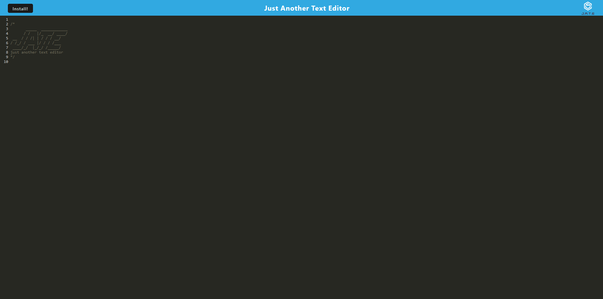

# Just Another Text Editor (JATE)
## Description
Practice your text editing skills with this neat little text editor!
### Why did I make this?
I just wanted to make another text editor because why not? Also, I really wanted to practice making a web application using a primitive JavaScript plugin (Weback) should the need ever arise in my web developer career.
### What problem does this solve?
This app didn't really come to be because of any problems. I just wanted to make my own text editor because why not?
### What did I learn?
I learned how to make a web app using Webpack. While it's true that more modern web apps have abandoned Webpack in favor of other, more efficient JS plugins like React, if you get a job in web deveopment and you're tasked with programming an app that uses a primitive plugin like Webpack, then it may be good to have at least some experince with Webpack and how it works so those apps can function properly.
## Link
https://jate-pwa-19.herokuapp.com/
## Screenshot

## Installation
N/A
## Usage
Everyone is free to try this out and practice their text editing skills!
## Credits
Link to Original Code: https://github.com/coding-boot-camp/cautious-meme

I would like to thank [Ashleyg5](https://github.com/Ashelyg5) for helping me out with configuring the Webpack files and helping me out with some functions.
## License
This uses the MIT License